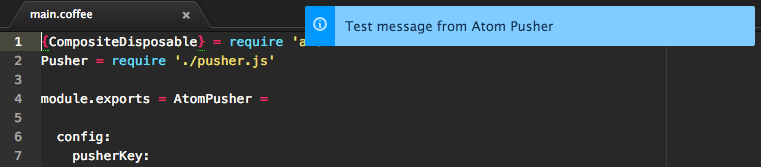

# Atom Pusher

This is an experimental package that shows notifications sent via [Pusher](http://pusher.com) in Atom.



Atom Pusher listens to the Pusher channel defined in the config, and shows
a notification whenever a message is received. Messages should have the
following format:

```json
{
  "title": "message title",
  "detail": "message text"
}
```

Feel free to fork and improve.
